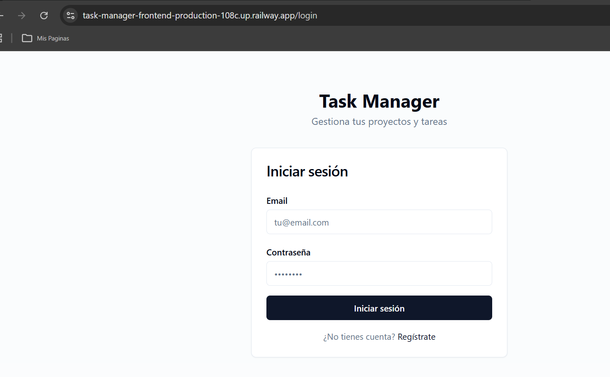
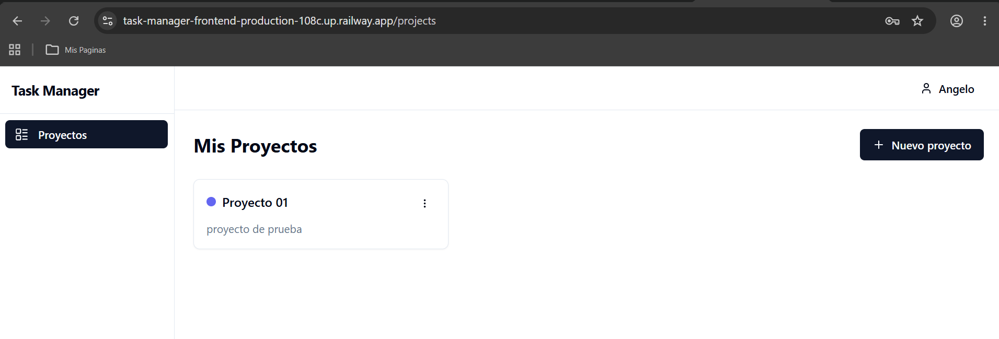

# Task Manager

Aplicación full-stack de gestión de proyectos y tareas, desarrollada como proyecto de portafolio siguiendo un enfoque de **Spec-Driven Development**.

**Demo en vivo:** https://task-manager-frontend-production-108c.up.railway.app
**API docs (Swagger):** https://task-manager-production-33d9.up.railway.app/swagger-ui.html

## Screenshots

| Login | Proyectos |
|---|---|
|  |  |

## Stack Tecnológico

**Backend**
- Java 21 + Spring Boot 3
- Spring Security con JWT (access + refresh tokens)
- Spring Data JPA + PostgreSQL 16
- Flyway (migraciones de base de datos)
- MapStruct (mapeo de DTOs)
- Lombok
- springdoc-openapi (Swagger UI)

**Frontend**
- React 18 + TypeScript + Vite
- Tailwind CSS
- TanStack Query
- React Hook Form + Zod
- Zustand
- Radix UI

**Infraestructura**
- Docker Compose (PostgreSQL, backend, frontend)
- Desplegado en Railway (backend, frontend y PostgreSQL como servicios independientes)

## Funcionalidades (MVP)

- Autenticación de usuarios (registro, login, JWT con access/refresh tokens)
- Gestión de proyectos (crear, editar, eliminar, listar)
- Gestión de tareas dentro de proyectos (crear, editar, eliminar, seguimiento de estado)

> Las funcionalidades de etiquetas, colaboración y dashboard están planificadas para una fase futura.

## Estructura del Proyecto

```
task-manager/
├── backend/          # API REST en Spring Boot
│   └── src/main/java/com/taskmanager/
│       ├── auth/         # Autenticación & JWT
│       ├── user/         # Dominio de usuario
│       ├── project/       # Dominio de proyectos
│       ├── task/         # Dominio de tareas
│       └── common/        # Configuración, excepciones y respuestas compartidas
├── frontend/         # SPA en React + TypeScript
│   └── src/
│       ├── api/          # Cliente de API
│       ├── components/    # Componentes compartidos y de UI
│       ├── features/      # Módulos de funcionalidades (auth, projects, tasks)
│       ├── pages/         # Páginas de rutas
│       ├── router/        # Configuración de rutas
│       ├── stores/         # Stores de Zustand
│       └── types/          # Tipos compartidos de TypeScript
└── docker-compose.yml
```

## Cómo Empezar

### Requisitos previos

- Docker y Docker Compose

### Configuración

1. Copia el archivo de variables de entorno y ajusta los valores necesarios:

   ```bash
   cp .env.example .env
   ```

2. Levanta todos los servicios:

   ```bash
   docker compose up --build
   ```

3. Accede a la aplicación:

   - Frontend: http://localhost
   - API Backend: http://localhost:8080
   - Swagger UI: http://localhost:8080/swagger-ui.html

## Desarrollo Local (sin Docker)

### Backend

```bash
cd backend
./mvnw spring-boot:run
```

Requiere una instancia de PostgreSQL en ejecución con las credenciales indicadas en `.env`.

### Frontend

```bash
cd frontend
cp .env.example .env
npm install
npm run dev
```

## Variables de Entorno

Consulta `.env.example` para ver la lista completa de opciones de configuración, incluyendo credenciales de base de datos y configuración de JWT.

## Decisiones de Arquitectura

### Backend: arquitectura por dominio
El código está organizado por dominio (`auth`, `user`, `project`, `task`) en lugar de por capa técnica (`controllers/`, `services/`, `repositories/`). Esto mantiene cohesión: todo lo relacionado con una entidad vive junto, lo que facilita escalar o extraer módulos sin atravesar múltiples carpetas.

### Autenticación: JWT con access + refresh tokens
Se optó por JWT stateless en lugar de sesiones en servidor. El access token tiene una vida corta (15 min) y el refresh token una larga (7 días). El frontend renueva el access token automáticamente mediante un interceptor de Axios cuando recibe un 401, sin interrumpir al usuario.

### Migraciones: Flyway en lugar de `ddl-auto`
Flyway gestiona el esquema de base de datos con archivos SQL versionados. Esto da control total sobre los cambios en producción y evita sorpresas del `spring.jpa.hibernate.ddl-auto=update`, que puede modificar o eliminar columnas de forma inesperada.

### Mapeo: MapStruct en lugar de mapeo manual
MapStruct genera el código de mapeo entre entidades y DTOs en tiempo de compilación. No hay reflexión en runtime, el rendimiento es equivalente a código manual, y los errores de mapeo se detectan al compilar.

### Frontend: TanStack Query para estado del servidor
El estado del servidor (proyectos, tareas) se maneja con TanStack Query, que provee caché, revalidación automática e invalidación selectiva. Zustand solo gestiona el estado de cliente (sesión del usuario), manteniendo una separación clara de responsabilidades.

### Frontend: Zod + React Hook Form para validación
La validación se define una sola vez en un schema Zod compartido entre el formulario y TypeScript. React Hook Form minimiza los re-renders durante la edición, lo que mejora la experiencia en formularios con muchos campos.
